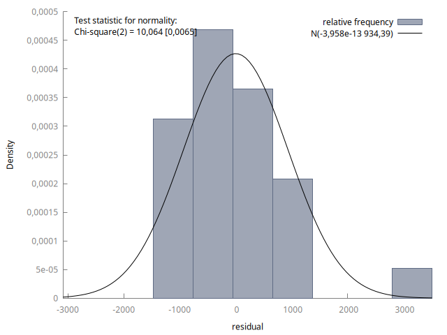

# Step A: Research question and data
## 1. Research question
## 2. Data set
# Step B: Analysis
## 1. Data Description & Summary
## 2. Simple regression model
## 3. Multiple regression Model 
## 4. Dummy variable analysis
## 4. Non-linear effects
## 5. Model selection and analysis


# Appendix
*Model 1*
$$
price_i = \beta_0 + \beta_1Age_i + u_i 
$$

a.
a.
a.
a.
a.

*Model 2*
$$
price_i = \beta_0 + \beta_1Age_i + \beta_2WinterRain_i  +\beta_3temp_i + \beta_3HarvestRain_i + u_i 
$$

a.
a.
a.

*Model 3*
$$
price_i = \beta_0 + \beta_1Dheavyraint_i + \beta_2tempt_i + \beta_3temp_i · Dheavyrain_i + u_i
$$

Legger til txt fil fra Gretl

``` 

```

Legger til png fra Gretl




```{r, echo=F}
knitr::knit_exit()
```

